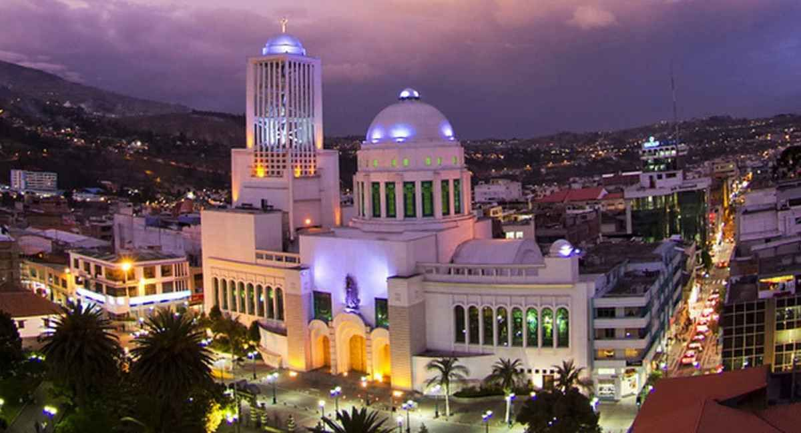
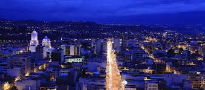
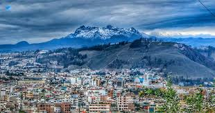
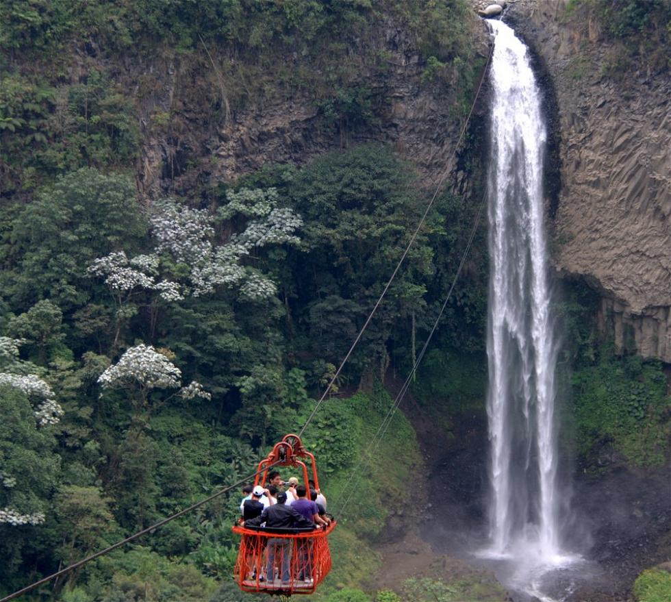

<html>
  <head>
    <title>HOME</title>
  </head>
  <body bgcolor ="sky blue">
    <h1 style ="color:red"; font size ="25"; font family ="verdana"; align ="center">CIUDAD DE AMBATO</h1>
    

    
San Juan Bautista de Ambato, ciudad ecuatoriana, capital de la provincia de Tungurahua. Es también conocida como Cuna de los Tres Juanes, 
     Tierrita Linda, Jardín del Ecuador y Ciudad de las Flores, Frutas y el Pan.
     En sus inicios Ambato se situó a la orilla derecha del río del mismo nombre, en el barrio comprendido entre lo que hoy es el Socavón, siendo su fundador Sebastián de Benalcázar por el año de 1535. En el año de 1570 
     por orden del presidente de la Real Audiencia de Quito, vino Antonio de Clavijo con el encargo de delinear las calles, plazas y señalar el sitio donde debía construirse la iglesia. En 1603 el Obispo Solís mandó a construir
      un nuevo templo, los trabajos se iniciaron el 24 de junio, día de San Juan, en su honor fue bautizada la ciudad con el nombre de San Juan Bautista de Ambato.
     
     
     
     
    
     
     
     
     
    
El primer asentamiento ambateño tuvo un fin trágico el jueves 20 de junio de 1698, pues a la una de la mañana un temblor violento destruyó en pocos 
     segundos a casi todas las casas e iglesia del lugar, la mayoría de sus habitantes fueron sorprendidos en pleno sueño y sepultados bajo los escombros de sus propias casas.
     El fiscal Antonio de Ron, previa la compra de las tierras a los indígenas quisapinchas, fundó por segunda ocasión Ambato en 1698. Para el año de 1756 contaba ya con unas 150 familias españolas y más o menos unos 6000 indígenas,
     se presentó entonces una solicitud ante el Virrey de Nueva Granada pidiéndole el ascenso de Ambato a la categoría de Villa, la que fue atendida en octubre del mismo año. Un 4 de febrero de 1797, fuertes temblores abrieron
     quebradas, hundieron montañas y destruyeron nuevamente Ambato.
     
     
     
     
    
     
     
     
     
    
Dentro de la época colonial se refundó Ambato como Asiento de Ambato a manos del Capitán Antonio Clavijo el día 6 de diciembre de 1698 como 
     circunscripción dentro del Corregimiento de Riobamba. Posteriormente, a pedido de sus habitantes y con orden judicial de la Real Audiencia de Quito, adquirió la categoría de Villa de Ambato el 26 de abril de 1757. 
     Con esta refundación por parte de los conquistadores españoles alcanzó una cierta posición como nodo comercial en la región.
     El 12 de noviembre de 1820 Ambato declara su independencia. El cantón Ambato formaba parte de la provincia de Chimborazo, pero mediante Decreto del 6 de noviembre de 1831, el Congreso Constitucional del Estado del Ecuador, 
     determinó que Ambato queda agregado a la provincia de Pichincha, considerando que el voto general de los habitantes de esta ciudad exigía la separación. El 23 de julio de 1860 adquiere la categoría de provincia y el 21 de mayo
     de 1861 se crea como tal mediante decreto de la Convención Nacional.
     
     
     
     
    
     
     
     
     
    
El municipio de Ambato ha tenido que atender urgentes problemas de su mejora o su progreso, pero sobre todo labores de reconstrucción constante, 
     que significo volver sobre lo ya hecho anteriormente repetir la fatigosa marcha, en cooperación de sus habitantes.
     Tanta labor y tan extraordinario derroche de energías han requerido la presencia frecuente, en el ayuntamiento de Ambato, de personas dueñas de fuerte civismo y de una acendrada moralidad política.
     El primer Comisario Municipal de Ambato fue Don Tomás Sevilla a quien se le atribuye la denominación de alcalde al primer Personero la apertura de la principal calle de la ciudad conocida actualmente con la denominación de Bolívar.
     En el año de 1945 la Décima Quinta Asamblea Nacional Constituyente decide dar la denominación de alcalde al primer personero Municipal a través de elecciones nombrando al Sr. Alfredo Coloma por un periodo de dos años, 
     
     
     
     
    
     
     
     
     
    
a partir de mencionado año y por elecciones populares se cuenta con alcaldes en el cantón.
     En el 2011 con la ordenanza de Denominación del Gobierno Autónomo Descentralizado Municipalidad de Ambato se resolvió denominar al Gobierno Cantonal de Ambato como Gobierno Autónomo Descentralizado Municipalidad de Ambato, 
     pudiendo también identificárselo como GAD Municipalidad de Ambato o por las siglas GADMA.
     
     
     
     
    
     
     
    <table border ="3 px">
      <tr>
        <td><a href ="https://tiagobaque1234l.github.io/Turismo-de-Ambato/">Turismo de Ambato</a></td>
        <td><a href ="https://tiagobaque1234l.github.io/Sitio-Geograficop-de-Ambato/">Sitio Geografico de Ambato</a></td>
        <td><a href ="https://tiagobaque1234l.github.io/Costumbres-de-Ambato/">costumbres de Ambato</a></td>
        <td><a href ="https://tiagobaque1234l.github.io/Galeria-de-Ambato/">Galeria de Ambato</a></td>
      </tr>
    </table>
  </body>
</html>
